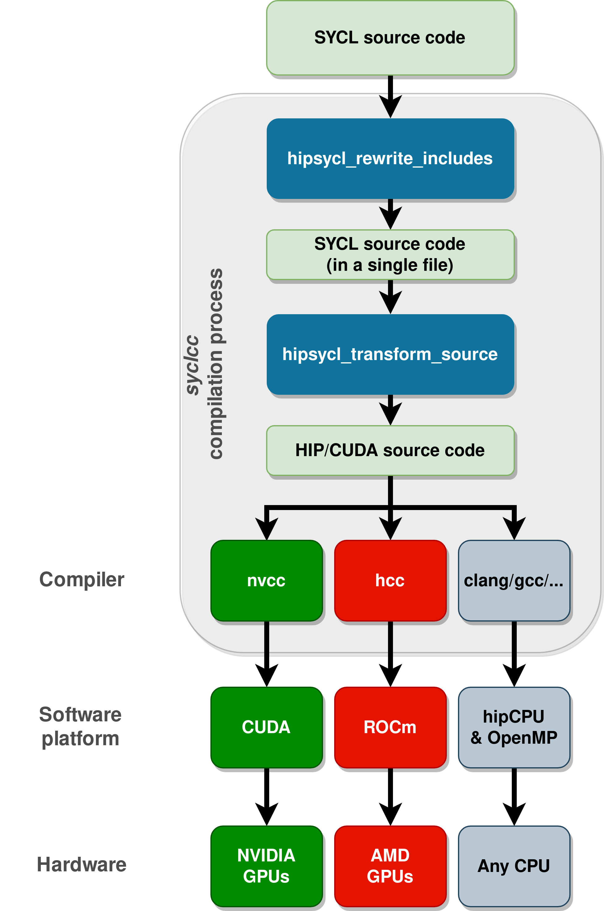

# hipSYCL - an implementation of SYCL over NVIDIA CUDA/AMD HIP
[](https://travis-ci.com/illuhad/hipSYCL)

The goal of the hipSYCL project is to develop a SYCL 1.2.1 implementation that builds upon NVIDIA CUDA/AMD HIP. hipSYCL consists of a SYCL runtime that runs on top of CUDA/HIP and a compiler portion in the form of a clang plugin. This plugin allows clang to directly compile SYCL code using its CUDA/HIP frontend for AMD GPUs using ROCm and NVIDIA GPUs using CUDA.

There is also a legacy source-to-source transformation toolchain available which automatically converts SYCL code into CUDA/HIP code behind the scenes. With this toolchain, it is even possible to use vendor compilers (like nvcc) to compile SYCL code. Due to limitations in nvcc this is however only recommended for very specific use cases.

hipSYCL's approach of running directly on top of the platforms best supported by GPU hardware vendors (ROCm/CUDA) allows applications to make use of all the latest CUDA and ROCm features (e.g. intrinsics). It also guarantees compatibility of hipSYCL applications with established and well-supported vendor tools (e.g. profilers) and libraries in the NVIDIA and AMD ecosystems.

## Why use hipSYCL over raw CUDA/HIP?
* hipSYCL provides a modern C++ API, including automatic resource management via reference counting semantics (see the SYCL spec for more details). No more worrying about missing cudaFree() calls. Unlike CUDA/HIP, (hip)SYCL does not require explicitly marking functions as `__host__` or `__device__` - the SYCL compiler will figure that out on its own.
* Openness. hipSYCL applications are written against an API that is an open standard (SYCL) instead of being locked to one specific vendor.
* Portability. hipSYCL ingests regular SYCL code which can also be executed on a variety of other SYCL implementations targeting different hardware. This is illustrated in the following image:
  
* Powerful, but intuitive programming model. SYCL (and by extension, hipSYCL) relies on an asynchronous task graph with support for out-of-order execution instead of the simple in-order queues (streams) provided by CUDA and HIP. This task graph is constructed based on the requirements (e.g. memory accesses) that the user specifies for one kernel. All data transfers between host and device are then executed automatically (if necessary) by the SYCL runtime. hipSYCL will optimize the execution order of the tasks and will for example automatically try to overlap kernels and data transfers, if possible. This allows for the development of highly optimized applications with little effort from the application developer.
* All CUDA or HIP intrinsics or other hardware specific features can still be used from within hipSYCL if desired. This is because an hipSYCL application is compiled with a regular CUDA/HIP compiler. Since hipSYCL attempts to parse the input source as regular SYCL, you _must_ surround the use of CUDA or HIP specific features with appropriate preprocessor guards. For more deatils, see the dedicated section *Using CUDA/HIP specific features in hipSYCL* below.

## How it works
hipSYCL relies on the fact that that both HIP/CUDA and SYCL are single-source programming models based on C++. In principle, this allows SYCL to be implemented as a HIP/CUDA library that simply wraps CUDA or HIP device or runtime functions. This wrapper could be very thin in practice with negligible performance impact due to aggressive inlining by device compilers. The SYCL application can then be compiled with the regular CUDA or ROCm compilers. As a side effect, this approach also brings access to CUDA and HIP specific features from SYCL code. This is exactly the idea behind hipSYCL.

Reality is unfortunately more complicated because the HIP/CUDA programming model is more restrictive than SYCL. For example, CUDA and HIP require that functions should be explicitly marked by the programmer whether they should be compiled for device or host. SYCL doesn't require this. To fix such restrictions, hipSYCL offers two approaches:
* The recommended approach is to use the clang-based hipSYCL toolchain. Using a clang plugin, hipSYCL adds additional AST and IR passes that augment clang's CUDA/HIP support to also compile SYCL code.
  This process is fully integrated in the `syclcc-clang` compiler wrapper, so users can just call `syclcc-clang` like a regular compiler and do not need to
  worry about the details. *Note:* `syclcc-clang` will be renamed to `syclcc` in the near future.
* Additionally, *manual mode* is available. In manual mode, users need to manually make sure that the input SYCL code is acceptable by a CUDA/HIP compiler. In particular, this means that users will need to make sure that all functions used in kernels are `__device__`. As an aid, hipSYCL contains source-to-source transformation tools that automatically add such attributes to the code as needed.
  This is *at the moment* still fully integrated in the `syclcc` compiler wrapper, which will do this transformation behind the scenes and then invoke the CUDA/HIP compiler. However, `syclcc` will be replaced by `syclcc-clang` in the near future, so users needing source-to-source transformation should not rely on it.

See below for an illustration of the hipSYCL compilation model.



## Current state
hipSYCL is still in an early stage of development. It can successfully execute many SYCL programs; but parts of the specification are not yet implemented.

### Limitations
#### Unimplemented major features 
* hierarchical kernel dispatch with flexible work group ranges (hierarchical dispatch with ranges fixed at `parallel_for_work_group` invocation is supported).
* Explicit memory copy functions (partially implemented)
* Atomics
* Device builtins (math library is mostly complete though)
* Images
* vec<> class lacks convert(), as(), swizzled temporary vector objects lack operators
* Some locks for multithreaded SYCL applications are missing.
* Error handling: wait_and_throw() and throw_asynchronous() do not invoke async handler
* 0-dimensional objects (e.g 0D accessors) are mostly unimplemented
* Because hipSYCL isn't based on OpenCL, all SYCL OpenCL interoperability features are unimplemented and may very likely never be available in hipSYCL.

#### Other limitations
* *Only in manual mode when compiling with nvcc*: In some cases, named kernels hit restrictions of NVIDIA's implementation of extended lambdas (lambdas that are used to instantiate templated kernels). NVIDIA does not allow kernel names to be local types in general. This especially affects names of execution policies in the SYCL parallel STL library. Workaround: Use unnamed kernels (or execution policies) or use global types. See [NVIDIA's official documentation of these restrictions](https://docs.nvidia.com/cuda/cuda-c-programming-guide/index.html#extended-lambda-restrictions).
* *Only in manual mode/when using the source-to-source transformation toolchain*: functors (like std::plus) or other functions from the STL cannot be used in hipSYCL kernel code. This is because hipSYCL would need to mark these functions as `__device__` to make the CUDA/HIP compiler accept the code, but this is not possible since hipSYCL cannot (and should not) modify STL code [The clang-based source-to-source transformation tool in hipSYCL may use a different STL than the one used by CUDA/HIP compilers, so it is not possible to embed modified STL headers in the transformed source file due to incompatibilities.]
* If the SYCL namespace is fully openend with a `using namespace cl::sycl` statement, bad name collisions can be expected since the SYCL spec requires the existence of SYCL vector types in that namespace with the same name as CUDA/HIP vector types which live in the global namespace.


## News
* 2019/05/12: hipSYCL now uses a clang plugin to compile SYCL code *directly*, without source-to-source transformation
* 2019/01/30: hipSYCL now uses clang as default CUDA compiler instead of nvcc.
* 2019/01/18: an implementation of a CPU backend based on OpenMP has been merged into hipSYCL's master branch!
* 2018/12/24: hipSYCL is capable of compiling and running at least some SYCL parallel STL algorithms (more testing ongoing)
* 2018/10/21: The source-to-source transformation step can now also correctly treat header files; the recommended input language for hipSYCL is now regular SYCL.
* 2018/10/07: hipSYCL now comes with an experimental additional source-to-source transformation step during compilation which allows hipSYCL to ingest regular SYCL code.
* 2018/9/24: hipSYCL now compiles cleanly on ROCm as well.

## Building and installing hipSYCL
In order to successfully build and install hipSYCL, the following major requirements must be met:
* **LLVM and clang >= 7** must be installed, including development files. 
* *For the CUDA backend*: 
  * **CUDA >= 9.0** must be installed.
  * For the legacy toolchain, either **clang or nvcc** must be in `$PATH`. The default (and recommended) CUDA compiler is clang due to known limitations and restrictions in nvcc's support of modern C++ features (see above). clang usually produces CUDA programs with very competitive performance compared to nvcc. Note that for CUDA 10 support, you need at least clang 8. For more information on compiling CUDA with clang, see [here](http://llvm.org/docs/CompileCudaWithLLVM.html).
  Our internal testing is conducted with CUDA 10 and clang 8 or nvcc from CUDA 10 with gcc 7.3.
* *For the ROCm backend*: 
  * **ROCm >= 2.0** must be installed. HIP must be installed and working. We test with the `rocm/rocm-terminal` docker image. For the legacy toolchain, **hcc** must be in `$PATH`. 
  * In order to use the new clang-based toolchain, **hipSYCL must be compiled against the same clang version used by ROCm** (at the moment clang 9)
* *For the CPU backend*: Any C++ compiler with **OpenMP** support should do. We test with clang 7, 8 and gcc 8.2.

### Packages
For Arch Linux users, it is recommended to simply use the `PKGBUILD` provided in `install/archlinux`. A simple `makepkg` in this directory should be enough to build an Arch Linux package.

### Singularity container images
hipSYCL comes with singularity definition files that allow you to create working hipSYCL distributions with a single command, no matter which Linux distribution you are using.

In order to build a ROCm-based hipSYCL singularity container image, simply run:
```
$ sudo singularity build <image-name> install/singularity/hipsycl-rocm.def
```

and for a CUDA based container image, execute:
```
$ sudo singularity build <image-name> install/singularity/hipsycl-cuda.def
```

### Docker container images
Dockerfiles for hipSYCL in conjunction with both CUDA and ROCm are also provided. To build a docker container image for ROCm, run
```
$ sudo docker build install/docker/ROCm
```
and
```
$ sudo docker build install/docker/CUDA
```
for CUDA.

### Manual compilation
hipSYCL depends on:
* python 3 (for the `syclcc` and `syclcc-clang` compiler wrappers)
* `cmake`
* An appropriate compiler for the backends that you wish to compile (see above, section *Building and installing hipSYCL*)
* HIP. On CUDA, it is not necessary to install HIP explicitly since the required headers are bundled with hipSYCL. On AMD, the system-wide HIP installation will be used instead and must be installed and working.
* llvm/clang (with development headers and libraries). LLVM/clang 8 and 9 are supported at the moment.
* the Boost C++ library (preprocessor, filesystem)

Once these requirements are met, clone the repository with all submodules:
```
$ git clone --recurse-submodules https://github.com/illuhad/hipSYCL
```
Then, create a build directory and compile hipSYCL:
```
$ cd <build directory>
$ cmake -DCMAKE_INSTALL_PREFIX=<installation prefix> <hipSYCL source directory>
$ make install
```
The default installation prefix is `/usr/local`. Change this to your liking.

## Compilation with clang-based toolchain: Using syclcc-clang
In order to compile software with hipSYCL, it is recommended to use `syclcc-clang` which automatically adds all required compiler arguments to the CUDA/HIP compiler. `syclcc-clang` can be used like a regular compiler, i.e. you can use `syclcc-clang -o test test.cpp` to compile your SYCL application called `test.cpp` with hipSYCL.

`syclcc-clang` accepts both command line arguments and environment variables to configure its behavior (e.g., to select the target platform CUDA/ROCm/CPU to compile for). See `syclcc-clang --help` for a comprehensive list of options.

## Legacy compilation toolchain: Using syclcc
**Note: `syclcc` will be replaced in the near future by `syclcc-clang` from the new toolchain!**

`hipSYCL's `syclcc` compiler wrapper will automatically execute the hipSYCL source-to-source transformation toolchain and then invoke either clang or nvcc (for the CUDA backend), hcc (for the ROCm backend) or an OpenMP-capable host compiler (for the CPU backend). If several backends are available,
the backend to be used must be explicitly specified by the user. This can be done either by setting the environment variable
```
export HIPSYCL_PLATFORM=<platform>
```
or with a command line argument for `syclcc`:
```
syclcc --hipsycl-platform=<platform> ...
```
where valid values for `<platform>` are 
* `cuda`, `nvidia` for CUDA, using clang as CUDA compiler
* `nvcc` for CUDA, using nvcc as CUDA compiler (not recommended unless you need specific features only available in nvcc)
* `rocm`, `amd`, `hip` or `hcc` for ROCm
* `cpu`, `host` or `hipcpu` for the CPU backend

Note that the CPU backend is at the moment "static", i.e. there's no decision possible at runtime whether to run a kernel on GPU or CPU. Where a kernel is executed depends only on the setting for the hipSYCL platform at compile time.

`syclcc` understands the following arguments or environment variables:


Command-line argument | Environment variable | Function
--------------------- | -------------------- | --------
`--hipsycl-platform=` | `HIPSYCL_PLATFORM`   | Selects the hipSYCL backend
`--cuda-clang-compiler=` | `HIPSYCL_CUDA_CLANG_COMPILER` | Selects the clang compiler for CUDA compilation. If not specified, defaults to the newest version of clang that can be found in `$PATH`.
`--keep-temporary-files` | *(None)* | Do not remove results of the source-to-source transformation; can be useful for debugging.
 *(None)* | `HIPSYCL_GPU_ARCH` | Selects the target GPU architecture for ROCm and CUDA (with clang as compiler). Can be combined with command line arguments of the respective compilers, in which case code will be compiled for all specified architectures. On clang: If no architecture is specified, `sm_52` is selected.
 *(None)* | `CXX` | For the CPU backend: Selects compiler. If not specified, `g++` will be tried followed by the newest version of clang in `$PATH`.


## Example
The following code adds two vectors:
```cpp
#include <cassert>
#include <iostream>

#include <CL/sycl.hpp>

using data_type = float;

std::vector<data_type> add(cl::sycl::queue& q,
                           const std::vector<data_type>& a,
                           const std::vector<data_type>& b)
{
  std::vector<data_type> c(a.size());

  assert(a.size() == b.size());
  cl::sycl::range<1> work_items{a.size()};

  {
    cl::sycl::buffer<data_type> buff_a(a.data(), a.size());
    cl::sycl::buffer<data_type> buff_b(b.data(), b.size());
    cl::sycl::buffer<data_type> buff_c(c.data(), c.size());

    q.submit([&](cl::sycl::handler& cgh){
      auto access_a = buff_a.get_access<cl::sycl::access::mode::read>(cgh);
      auto access_b = buff_b.get_access<cl::sycl::access::mode::read>(cgh);
      auto access_c = buff_c.get_access<cl::sycl::access::mode::write>(cgh);

      cgh.parallel_for<class vector_add>(work_items,
                                         [=] (cl::sycl::id<1> tid) {
        access_c[tid] = access_a[tid] + access_b[tid];
      });
    });
  }
  return c;
}

int main()
{
  cl::sycl::queue q;
  std::vector<data_type> a = {1.f, 2.f, 3.f, 4.f, 5.f};
  std::vector<data_type> b = {-1.f, 2.f, -3.f, 4.f, -5.f};
  auto result = add(q, a, b);

  std::cout << "Result: " << std::endl;
  for(const auto x: result)
    std::cout << x << std::endl;
}

```

## Using CUDA/HIP specific features in hipSYCL
### clang-based toolchain
Assume `kernel_function` is a function used in a SYCL kernel. Platform specific features can be used as follows:
```cpp
__host__ __device__
void optimized_function()
{
#ifdef SYCL_DEVICE_ONLY
  #ifdef HIPSYCL_PLATFORM_CUDA
  // CUDA specific device functions can be called here
  #elif defined(HIPSYCL_PLATFORM_HCC)
  // ROCm specific device functions can be called here
  #endif
#endif
}

void kernel_function()
{
#if defined(__HIPSYCL__) && defined(SYCL_DEVICE_ONLY)
  optimized_function()
#else
  // Regular SYCL version here
#endif
}
```
This construct may seem slightly complicated. The reason for this is that clang initially parses all SYCL code as host code, so only `__host__ __device__` functions can be called from kernels. Additionally, clang requires that host code must be present and correct even when compiling for device.

### Manual mode / legacy toolchain
Assume again `kernel_function` is a function used in a SYCL kernel. Using the legacy toolchain, platform specific features can be used like shown here:

```cpp

void kernel_function()
{
#ifdef HIPSYCL_PLATFORM_CUDA
  // CUDA specific device functions can be called here
#elif defined(HIPSYCL_PLATFORM_HCC)
  // ROCm specific device functions can be called here
#else
  // Regular SYCL function here
#endif 
}

```


