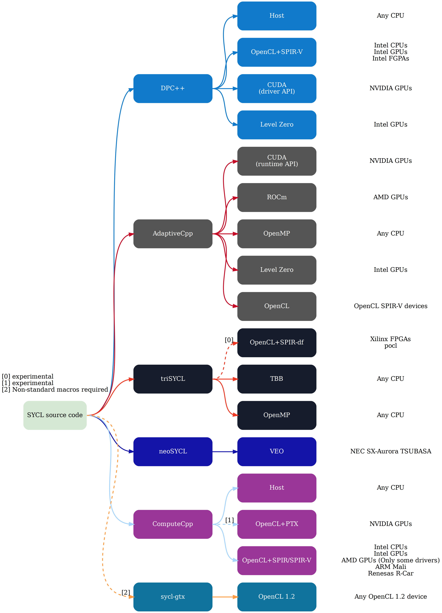

# Open SYCL (formerly known as hipSYCL)

**(Note: This project is currently in progress of changing its name. Documentation and code may still use the older name hipSYCL)**

Open SYCL is a modern SYCL implementation targeting CPUs and GPUs from all major vendors that supports many use cases and approaches for implementing SYCL:

1. **A generic, single-pass compiler infrastructure that compiles kernels to a unified code representation** that is then lowered at runtime to target devices, providing a high degree of portability, low compilation times, flexibility and extensibility. Support includes:
   1. NVIDIA CUDA GPUs through PTX;
   2. AMD ROCm GPUs through amdgcn code;
   3. Intel GPUs through SPIR-V;
2. Additionally, **Open SYCL can aggregate existing clang toolchains and augment them with support for SYCL constructs**. This allows for a high degree of interoperability between SYCL and other models such as CUDA or HIP. Support includes:
   1. Any LLVM-supported CPU (including e.g. x86, arm, power etc) through the regular clang host toolchain with dedicated compiler transformation to accelerate SYCL constructs;
   2. NVIDIA CUDA GPUs through the clang CUDA toolchain;
   3. AMD ROCm GPUs through the clang HIP toolchain;
   4. Intel GPUs through oneAPI Level Zero and the clang SYCL toolchain (*highly* experimental)
3. Or **Open SYCL can be used in library-only compilation flows**. In these compilation flows, Open SYCL acts as a C++ library for third-party compilers. This can have portability advantages or simplify deployment. This includes support:
   1. Any CPU supported by any OpenMP compilers;
   2. NVIDIA GPUs through CUDA and the NVIDIA nvc++ compiler, bringing NVIDIA vendor support and day 1 hardware support to the SYCL ecosystem

Open SYCL supports compiling source files into a single binary that can run on all these backends when building against appropriate clang distributions. Additionally, **Open SYCL is the only major SYCL implementation that supports a single-pass compiler design, where the code is only parsed once for both host and target devices**. More information about the supported [compilation flows can be found here](doc/compilation.md).

The runtime architecture of Open SYCL consists of the main library `hipSYCL-rt`, as well as independent, modular plugin libraries for the individual backends:

Open SYCL's compilation and runtime design allows Open SYCL to 
* Either provide a **single, unified compiler infrastructure with a single code representation across all targets**, or
* to **effectively aggregate multiple toolchains that are otherwise incompatible, making them accessible with a single SYCL interface.**

The philosophy behind Open SYCL is to leverage such existing toolchains as much as possible. This brings not only maintenance and stability advantages, but enables performance on par with those established toolchains by design, and also allows for maximum interoperability with existing compute platforms.
For example, the Open SYCL CUDA and ROCm backends rely on the clang CUDA/HIP frontends that have been augmented by Open SYCL to *additionally* also understand SYCL code. This means that the Open SYCL compiler can not only compile SYCL code, but also CUDA/HIP code *even if they are mixed in the same source file*, making all CUDA/HIP features - such as the latest device intrinsics - also available from SYCL code ([details](doc/hip-source-interop.md)). Additionally, vendor-optimized template libraries such as rocPRIM or CUB can also be used with Open SYCL. Consequently, Open SYCL allows for **highly optimized code paths in SYCL code for specific devices**.

Because a SYCL program compiled with Open SYCL looks just like any other CUDA or HIP program to vendor-provided software, vendor tools such as profilers or debuggers also work well with Open SYCL.

The following image illustrates how Open SYCL fits into the wider SYCL implementation ecosystem:

## About the project

While Open SYCL started its life as a hobby project, development is now led and funded by Heidelberg University. Open SYCL not only serves as a research platform, but is also a solution used in production on machines of all scales, including some of the most powerful supercomputers.

### Contributing to Open SYCL

We encourage contributions and are looking forward to your pull request! Please have a look at [CONTRIBUTING.md](CONTRIBUTING.md). If you need any guidance, please just open an issue and we will get back to you shortly.

If you are a student at Heidelberg University and wish to work on Open SYCL, please get in touch with us. There are various options possible and we are happy to include you in the project :-)

### Citing Open SYCL

Open SYCL is a research project. As such, if you use Open SYCL in your research, we kindly request that you cite one of the following publications, depending on your focus:

* A general overview, SYCL 2020, performance and the relationship with oneAPI: *Aksel Alpay, Bálint Soproni, Holger Wünsche, and Vincent Heuveline. 2022. Exploring the possibility of a hipSYCL-based implementation of oneAPI. In International Workshop on OpenCL (IWOCL'22). Association for Computing Machinery, New York, NY, USA, Article 10, 1–12. https://doi.org/10.1145/3529538.3530005*
* The generic single-pass compiler: *Aksel Alpay and Vincent Heuveline. 2023. One Pass to Bind Them: The First Single-Pass SYCL Compiler with Unified Code Representation Across Backends. In Proceedings of the 2023 International Workshop on OpenCL (IWOCL '23). Association for Computing Machinery, New York, NY, USA, Article 7, 1–12. https://doi.org/10.1145/3585341.3585351*
* Our CPU compiler: *Joachim Meyer, Aksel Alpay, Sebastian Hack, Holger Fröning, and Vincent Heuveline. 2023. Implementation Techniques for SPMD Kernels on CPUs. In Proceedings of the 2023 International Workshop on OpenCL (IWOCL '23). Association for Computing Machinery, New York, NY, USA, Article 1, 1–12. https://doi.org/10.1145/3585341.3585342*
* The original talk and the idea of implementing SYCL on non-OpenCL backends: *Aksel Alpay and Vincent Heuveline. 2020. SYCL beyond OpenCL: The architecture, current state and future direction of hipSYCL. In Proceedings of the International Workshop on OpenCL (IWOCL ’20). Association for Computing Machinery, New York, NY, USA, Article 8, 1. DOI:https://doi.org/10.1145/3388333.3388658*

(The latter is a talk and available [online](https://www.youtube.com/watch?v=kYrY80J4ZAs). Note that some of the content in this talk is outdated by now)

### Acknowledgements

We gratefully acknowledge [contributions](https://github.com/illuhad/hipSYCL/graphs/contributors) from the community.

## Performance

Open SYCL has been repeatedly shown to deliver very competitive performance compared to other SYCL implementations or proprietary solutions like CUDA. See for example:

* *Sohan Lal, Aksel Alpay, Philip Salzmann, Biagio Cosenza, Nicolai Stawinoga, Peter Thoman, Thomas Fahringer, and Vincent Heuveline. 2020. SYCL-Bench: A Versatile Single-Source Benchmark Suite for Heterogeneous Computing. In Proceedings of the International Workshop on OpenCL (IWOCL ’20). Association for Computing Machinery, New York, NY, USA, Article 10, 1. DOI:https://doi.org/10.1145/3388333.3388669*
* *Brian Homerding and John Tramm. 2020. Evaluating the Performance of the hipSYCL Toolchain for HPC Kernels on NVIDIA V100 GPUs. In Proceedings of the International Workshop on OpenCL (IWOCL ’20). Association for Computing Machinery, New York, NY, USA, Article 16, 1–7. DOI:https://doi.org/10.1145/3388333.3388660*
* *Tom Deakin and Simon McIntosh-Smith. 2020. Evaluating the performance of HPC-style SYCL applications. In Proceedings of the International Workshop on OpenCL (IWOCL ’20). Association for Computing Machinery, New York, NY, USA, Article 12, 1–11. DOI:https://doi.org/10.1145/3388333.3388643*

### Extracting performance & benchmarking Open SYCL

#### General performance hints

* Building Open SYCL against newer LLVM generally results in better performance for backends that are relying on LLVM.
* Unlike other SYCL implementations that may rely on kernel compilation at runtime, Open SYCL relies heavily on ahead-of-time compilation. So make sure to use appropriate optimization flags when compiling.
* For the CPU backend:
   * Don't forget that, due to Open SYCL's ahead-of-time compilation nature, you may also want to enable latest vectorization instruction sets when compiling, e.g. using `-march=native`.
   * Enable OpenMP thread pinning (e.g. `OMP_PROC_BIND=true`). Open SYCL uses asynchronous worker threads for some light-weight tasks such as garbage collection, and these additional threads can interfere with kernel execution if OpenMP threads are not bound to cores.
   * Don't use `nd_range` parallel for unless you absolutely have to, as it is difficult to map efficiently to CPUs. 
      * If you don't need barriers or local memory, use `parallel_for` with `range` argument.
      * If you need local memory or barriers, scoped parallelism or hierarchical parallelism models may perform better on CPU than `parallel_for` kernels using `nd_range` argument and should be preferred. Especially scoped parallelism also works well on GPUs.
      * If you *have* to use `nd_range parallel_for` with barriers on CPU, the `omp.accelerated` compilation flow will most likely provide substantially better performance than the `omp.library-only` compilation target. See the [documentation on compilation flows](doc/compilation.md) for details.

#### Comparing against other LLVM-based compilers

When targeting the CUDA or HIP backends, Open SYCL just massages the AST slightly to get `clang -x cuda` and `clang -x hip` to accept SYCL code. Open SYCL is not involved in the actual code generation. Therefore *any significant deviation in kernel performance compared to clang-compiled CUDA or clang-compiled HIP is unexpected.*

As a consequence, if you compare it to other llvm-based compilers please make sure to compile Open SYCL against the same llvm version. Otherwise you would effectively be simply comparing the performance of two different LLVM versions. This is in particular true when comparing it to clang CUDA or clang HIP.

## Current state
Open SYCL is not yet a fully conformant SYCL implementation, although many SYCL programs already work with Open SYCL.
* SYCL 2020 [feature support matrix](https://github.com/hipSYCL/featuresupport)
* A (likely incomplete) list of [limitations](doc/limitations.md) for older SYCL 1.2.1 features
* A (also incomplete) timeline showing development [history](doc/history.md)

## Hardware and operating system support

Supported hardware:
* Any CPU for which a C++17 OpenMP compiler exists
* NVIDIA CUDA GPUs. Note that clang, which Open SYCL relies on, may not always support the very latest CUDA version which may sometimes impact support for *very* new hardware. See the [clang documentation](https://www.llvm.org/docs/CompileCudaWithLLVM.html) for more details.
* AMD GPUs that are [supported by ROCm](https://github.com/RadeonOpenCompute/ROCm#hardware-support)

Operating system support currently strongly focuses on Linux. On Mac, only the CPU backend is expected to work. Windows support with CPU and CUDA backends is experimental, see [Using Open SYCL on Windows](https://github.com/illuhad/hipSYCL/wiki/Using-hipSYCL-on-Windows).

## Installing and using Open SYCL
* [Building & Installing](doc/installing.md)

In order to compile software with Open SYCL, use `syclcc` which automatically adds all required compiler arguments to the CUDA/HIP compiler. `syclcc` can be used like a regular compiler, i.e. you can use `syclcc -o test test.cpp` to compile your SYCL application called `test.cpp` with Open SYCL.

`syclcc` accepts both command line arguments and environment variables to configure its behavior (e.g., to select the target platform CUDA/ROCm/CPU to compile for). See `syclcc --help` for a comprehensive list of options.

When compiling with Open SYCL, you will need to specify the targets you wish to compile for using the `--hipsycl-targets="backend1:target1,target2,...;backend2:..."` command line argument, `HIPSYCL_TARGETS` environment variable or cmake argument. See the documentation on [using Open SYCL](doc/using-hipsycl.md) for details.

Instructions for using Open SYCL in CMake projects can also be found in the documentation on [using Open SYCL](doc/using-hipsycl.md).

## Documentation
* Open SYCL [design and architecture](doc/architecture.md)
* Open SYCL runtime [specification](doc/runtime-spec.md)
* Open SYCL [compilation model](doc/compilation.md)
* How to use raw HIP/CUDA inside Open SYCL code to create [optimized code paths](doc/hip-source-interop.md)
* A simple SYCL example code for testing purposes can be found [here](doc/examples.md).
* [SYCL Extensions implemented in Open SYCL](doc/extensions.md)
* [Macros used by Open SYCL](doc/macros.md)
* [Environment variables supported by Open SYCL](doc/env_variables.md)

