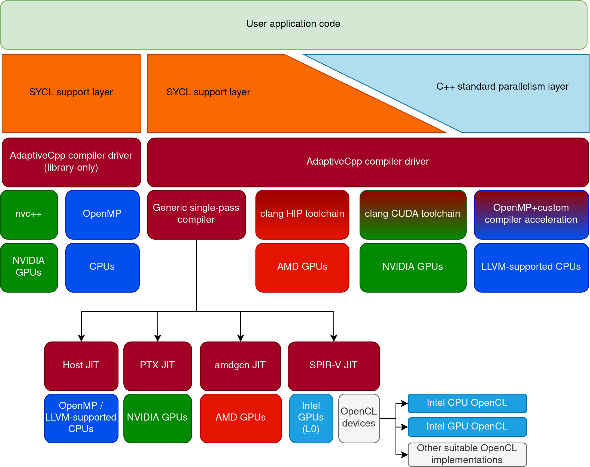

# AdaptiveCpp compilation flows

AdaptiveCpp supports multiple types of compilation flows:

1. **A generic, single-pass compiler infrastructure that compiles kernels to a unified code representation** that is then lowered at runtime to target devices, providing a high degree of portability, low compilation times, flexibility and extensibility. **AdaptiveCpp is the only major SYCL implementation that supports a single-pass compiler design, where the code is only parsed once for both host and target devices**. Support includes:
   1. NVIDIA CUDA GPUs through PTX;
   2. AMD ROCm GPUs through amdgcn code;
   3. Intel GPUs through SPIR-V (Level Zero);
   4. SPIR-V compatible OpenCL devices supporting Intel USM extensions or fine-grained system SVM (such as Intel's OpenCL implementation for CPUs or GPUs);
   5. The host CPU through LLVM
2. Interoperability-focused multipass compilation flows. **AdaptiveCpp can aggregate existing clang toolchains and augment them with support for SYCL constructs**. This allows for a high degree of interoperability between SYCL and other models such as CUDA or HIP. For example, in this mode, the AdaptiveCpp CUDA and ROCm backends rely on the clang CUDA/HIP frontends that have been augmented by AdaptiveCpp to *additionally* also understand other models like SYCL. This means that the AdaptiveCpp compiler can not only compile SYCL code, but also CUDA/HIP code *even if they are mixed in the same source file*, making all CUDA/HIP features - such as the latest device intrinsics - also available from SYCL code ([details](hip-source-interop.md)). Additionally, vendor-optimized template libraries such as rocPRIM or CUB can also be used with AdaptiveCpp. This allows for highly optimized code paths in SYCL code for specific devices. Support includes:
   1. Any LLVM-supported CPU (including e.g. x86, arm, power etc) through the regular clang host toolchain with dedicated compiler transformation to accelerate SYCL constructs;
   2. NVIDIA CUDA GPUs through the clang CUDA toolchain;
   3. AMD ROCm GPUs through the clang HIP toolchain
3. Or **AdaptiveCpp can be used in library-only compilation flows**. In these compilation flows, AdaptiveCpp acts as a C++ library for third-party compilers. This can have portability advantages or simplify deployment. This includes support for:
   1. Any CPU supported by any OpenMP compilers;
   2. NVIDIA GPUs through CUDA and the NVIDIA nvc++ compiler, bringing NVIDIA vendor support and day 1 hardware support to the SYCL ecosystem

The following illustration shows the complete stack and its capabilities to target hardware:

## Generic SSCP compilation flow (`--acpp-targets=generic`)

**Note:** This flow is AdaptiveCpp's default compilation flow, and for good reason: It compiles faster, typically generates faster code, and creates portable binaries. It is one of the focal points of our work, and development is thus moving quickly.

AdaptiveCpp supports a generic single-pass compiler flow, where a single compiler invocation generates both host and device code. The SSCP compilation consists of two stages:
1. Stage 1 happens at compile time: During the regular C++ host compilation, AdaptiveCpp extracts LLVM IR for kernels with backend-independent representations of builtins, kernel annotations etc. This LLVM IR is embedded in the host code. During stage 1, it is not yet known on which device(s) the code will ultimately run.
2. Stage 2 typically happens at runtime: The embedded device IR is passed to AdaptiveCpp's `llvm-to-backend` infrastructure, which lowers the IR to backend-specific formats, such as NVIDIA's PTX, SPIR-V or amdgcn code. Unlike stage 1, stage 2 assumes that the target device is known. While stage 2 typically happens at runtime, support for precompiling to particular devices and formats could be added in the future.

The generic SSCP design has several advantages over other implementation choices:
* There is a single code representation across all backends, which allows implementing JIT-based features such as runtime kernel fusion in a backend-independent way;
* Code is only parsed a single time, which can result is significant compilation speedups especially for template-heavy code;
* Binaries inherently run on a wide range of hardware, without the user having to precompile for particular devices, and hence making assumptions where the binary will ultimately be executed ("Compile once, run anywhere").

The generic SSCP flow can potentially provide very fast compile times, very good portability and good performance.

### Implementation status

The SSCP flow is supported for all backends.

Some features (e.g. SYCL 2020 reductions or group algorithms) are not yet implemented.

### How it works

Details on the implementation of the generic SSCP compiler can be found [here](generic-sscp.md)

## Compilation flows focused on interoperability and deployment simplicity (`--acpp-targets=omp;cuda;hip`)

*Note:* If your primary concern is not interoperability or deployment simplicity but instead e.g. performance or portability, you should probably use the generic SSCP compiler (`--acpp-targets=generic`) instead.

AdaptiveCpp's interoperability compilation flows rely on the fact that many existing programming models as well as SYCL are single-source programming models based on C++. This means that it is possible to extend existing toolchains, such as the CUDA and the HIP toolchains, to also support SYCL code. AdaptiveCpp does that by using clang's CUDA and HIP toolchains with a custom clang plugin.
AdaptiveCpp contains mechanisms to embed and aggregate compilation results from multiple toolchains into a single binary, allowing it to effectively combine multiple toolchains into one.

AdaptiveCpp distinguishes multiple kinds of compilation models focused on interoperability and deployment simplicity:

1. *SMCP* (single-source, multiple compiler pass) models, where AdaptiveCpp extends existing heterogeneous toolchains to also understand SYCL constructs. These toolchains rely on performing multiple compiler passes for host and device code. Here, we distinguish two flavors:
    1. `cuda.integrated-multipass`, `hip.integrated-multipass`: *Integrated multipass* compilation flows, where host and device compilation passes are handled by clang's CUDA and HIP drivers. This mode allows for the most interoperability with backends because backend-specific language extensions are also available in the host pass. For example, kernels can be launched using the `<<<>>>` syntax. However, limitations in clang's compilation drivers also affect AdaptiveCpp in this mode. In particular, CUDA and HIP cannot be targeted simultaneously because host code cannot support language extensions from *both* at the same time.
    2. `cuda.explicit-multipass`, `hip.explicit-multipass`: *Explicit multipass* compilation flows, where host and device compilation passes are handled by AdaptiveCpp's `acpp` compiler driver. Here, `acpp` invokes backend-specific device passes, which then result in a compiled kernel image for the target device. `acpp` then embeds the compiled kernel image into the host binary. At runtime, the kernel is extracted from the image and invoked using runtime functions instead of language extensions. As a consequence, explicit multipass compilation for one backend can be combined with arbitrary other backends simultaneously, allowing AdaptiveCpp to target multiple device backends at the same time. Note that in explicit multipass, different guarantees might be made regarding the availability of backend-specific language extensions in the host pass compared to integrated multipass. See the section on language extension guarantees below for more details.
2. *library-only*, where AdaptiveCpp acts as a library for a third-party compiler. This approach mostly is beneficial for deployment simplicity, but may not be optimal for functionality of performance. This approach is taken by the `omp.library-only` and `cuda-nvcxx` compilation flows.
    1. `omp.library-only` allows using AdaptiveCpp as a library for third-party OpenMP compilers, and can execute kernels on the host CPU.
    2. `cuda-nvcxx` allows using AdaptiveCpp as a library for NVIDIA's nvc++ compiler, and can execute kernels on NVIDIA GPUs.   
3. `omp.accelerated`: *Compiler-accelerated host pass*, where a regular C++ host pass is augmented with additional compiler transformations to increase performance of certain SYCL constructs when running on CPU.

### Language extension guarantees

AdaptiveCpp allows using backend-specific language extensions (e.g. CUDA/HIP C++) in the interoperability-focused compilation flows. The precise guarantees about the availability of these extensions are as follows:

* If a backend runs on a compiler that provides a unified, single compilation pass for both host and device, backend-specific language extensions are always available. Currently this only affects the CUDA-nvc++ backend.
* If the compiler relies on separate compilation passes for host and device:
  * In device compilation passes, backend-specific language extensions are always available.
  * In host compilation passes, the following applies:
    * If the backend runs in integrated multipass mode, backend-specific language extensions are available.
    * If the backend runs in explicit multipass mode:
      * For SPIR-V, language extensions are always available
      * For CUDA and HIP: Language extensions from *one* of them are available in the host pass.
        * If one of them runs in integrated multipass and one in explicit multipass, language extensions from the one in integrated multipass are available
        * If both are in explicit multipass, `acpp` will currently automatically pick one that will have language extensions enabled in the host pass.

## Summary of supported compilation targets

Not all backends necessarily support all models. The following compilation flows are currently supported, and can be requested as backend targets in `acpp`. Note that some are available in both explicit multipass and integrated multipass flavor:

| Compilation flow | Target hardware | Model | Short description |
|------------------|-------------------|-------------------|-------------------|
| `omp.library-only` | Any CPU | Library-only | CPU backend (OpenMP library) |
| `omp.accelerated` | Any CPU supported by LLVM | Accelerated host pass | CPU backend (OpenMP library with additional clang acceleration) |
| `cuda.integrated-multipass` | NVIDIA GPUs | Integrated SMCP | CUDA backend|
| `cuda.explicit-multipass` | NVIDIA GPUs | Explicit SMCP | CUDA backend |
| `cuda-nvcxx` | NVIDIA GPUs | Library-only | CUDA backend using nvc++ |
| `hip.integrated-multipass` | AMD GPUs (supported by ROCm) | Integrated SMCP | HIP backend |
| `hip.explicit-multipass` | AMD GPUs (supported by ROCm) | Explicit SMCP | HIP backend |
| `generic` | (see below) | Generic SSCP | Generic single-pass flow |

**Note:** 
* Explicit multipass requires building AdaptiveCpp against a clang that supports `__builtin_unique_stable_name()` (available in clang 11), or clang 13 or newer as described in the [installation documentation](installing.md). `hip.explicit-multipass` requires clang 13 or newer.
* Generic SSCP requires clang 14 or newer.

## Compiler support to accelerate nd_range parallel_for on CPUs (omp.accelerated)

The `nd_range parallel_for` paradigm is not efficiently implementable without explicit compiler support.
AdaptiveCpp however provides multiple options to circumvent this.

1. The recommended and library-only solution is writing kernels using a performance portable
paradigm as AdaptiveCpp's [scoped parallelism](scoped-parallelism.md) extension.
2. If that is not an option (e.g. due to preexisting code), AdaptiveCpp provides a compiler extension that allows efficient execution of the nd_range paradigm at the cost of forcing the host compiler to Clang.
3. Without the Clang plugin, a fiber-based implementation of the `nd_range` paradigm will be used.
However, the relative cost of a barrier in this paradigm is significantly higher compared to e.g. GPU backends. This means that kernels relying on barriers may experience substantial performance degradation, especially if the ratio between barriers and other instructions was tuned for GPUs. Additionally, utilizing barriers in this scenario may prevent vectorization across work items.

For the compiler extension variant, the AdaptiveCpp Clang plugin implements a set of passes to perform deep loop fission
on nd_range parallel_for kernels that contain barriers. The continuation-based synchronization
approach is employed to achieve good performance and functional correctness (_Karrenberg, Ralf, and Sebastian Hack. "Improving performance of OpenCL on CPUs." International Conference on Compiler Construction. Springer, Berlin, Heidelberg, 2012. [https://link.springer.com/content/pdf/10.1007/978-3-642-28652-0_1.pdf](https://link.springer.com/content/pdf/10.1007/978-3-642-28652-0_1.pdf)_).
A deep dive into how the implementation works and why this approach was chosen
can be found in Joachim Meyer's [master thesis](https://joameyer.de/hipsycl/Thesis_JoachimMeyer.pdf).

For more details, see the [installation instructions](installing.md) and the documentation [using AdaptiveCpp](using-hipsycl.md).

## acpp compilation driver

The `acpp` compilation driver is responsible for controlling the active compilation flows.
The following image illustrates the different flows that AdaptiveCpp supports through `acpp`.

## File format for embedded device code

AdaptiveCpp relies on the [heterogeneous container format (HCF)](hcf.md) whenever it takes control over the embedding process of device code (e.g. explicit multipass scenarios).
